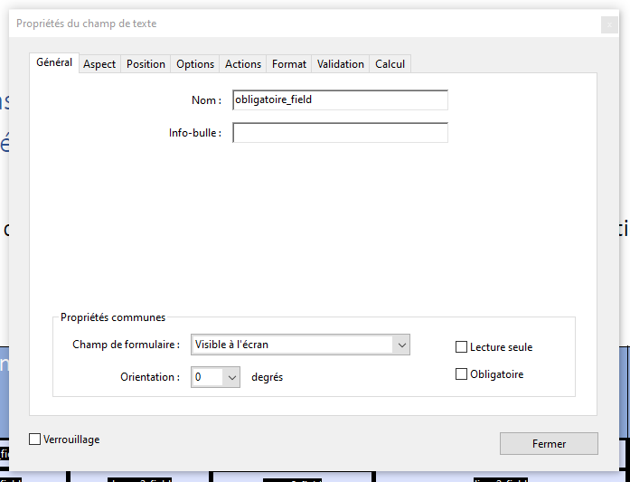

# Admin

Cette partie consiste a modifiées les regles de financement par OPCO ainsi que les templates utilisée.
Pour povoir accéder a cette partie il est nécéssaire d'etre connecter.
La partie admin se décompose en 3 parties :


## Tableau de bord

Cette partie permet d'avoir un visuel sur chacunes des regles ainsi que modifier, crée et supprimer des regles.

### Ajouter une regle

En cliquant sur le bouton, ci-dessous il permet d'ouvrir une modal qui permét de renseignier les différent élémeent qui compose cette nouvell regle.


- L'opco concernée
- Durée / Formule
- La zone géographique
- Forfait 1 par nuit / repas peut etre null
- Forfait 1
- Forfait CFA
- Le texte du forfait non défini peut etre égale a null
- Et le montnat du forfait 1 defaut : Le meme pour chacune des regle de l'OPCO concernée

Ce formulaire appelle la méthode :
```php
/**
 * Fonction qui traite la création et la modification d'une RegleOpco
 * Dans le champs inputs, s'il contient le champ regle_id => modifciation, sinon création
 * @param Request $request
 * @return back()
*/
public function regleOpco(Request $request) {
    // crée ou update selon le parametre regle_id 
}
```


## Données Annexe

Ici vous pouvez modifée l'intitule des zones géographiques utilisée, ainsi que les tempalte utilisée :  

### Modification des template

Le fichier PDF doit etre un fichier PDF disposant d'un formulaire réaliser via Adobe.  
Ce fichier doit contenir des champs de formulaire avec les clefs ci-dessous, ces clefs seront modifée par les valeur saisies par les secrétaires.  
Le nom doit etre renseigniée a cette endroit dans Adobe : 

:::caution

**Attention** Le formulaire présent dans le fichier PDF doit avoir les même nom identiquement (sensible a la casse)

::: 



- obligatoire_field : Es que la mobilitée prévue par l'annexe 3 ets obligatoire pour l'obtentions du diplome
Pour chaque périodes (X étant la période 1, puis 2, puis ... 5):
- debut_X_field : date de début de la période X
- fin_X_field : date de fin de la période X
- duree_X_field : Duree de la période X
- zone_X_field : zone géographique de la période X
- lieu_X_field : Lieu de la période X
- organisme_X_field : Organisme (oui/Non) de la période X

- nb_nuits_field : Text nonbre de nuit ("Non" ou "Oui Nb")
- forfait_nuits_field : Montant du forfait ("" ou Montant €)
- nb_repas_field : Text nombre de repas ("Non" ou "Oui Nb")
- forfait_nuits_field : Montant du forfait ("" ou Montant €)
- forfait_glob_bool_field : Text nombre du forfait global pour l'apprenant ("Non" ou "Oui")
- forfait_glob_montant_field : Montant du forfait ("" ou Montant €)
- forfait_cfa_bool_field : Text nombre du forfait global pour le CFA ("Non" ou "Oui")
- montant_cfa_field : Montant du forfait ("" ou Montant €)
- pas_forfait_field : Text en cas de forfait non définit en prévisionel 
- texte_libre_field : Text libre renseigniée lors de l'envoie du formulaire ("", ou text)