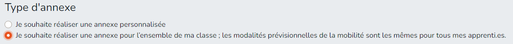

# Génération de l'annexe 3 

## MySup V1


L'utilisateur de MySup v1, lorsqu'il est sur le visuel du contrat, lors du clique sur le bouton (Annexe 3 de la convention).  
Il arrive sur l'application, la requete vas sur la méthode du controller PrincipalController :


```php
/**
 * Traitement lors de la source MySUp v1 recherche les différentes infos a partir du contrat
 * Si le contrat est trouver dans la base tompon (avec 2 jours de retard) récupere les données, sinon recupere les données via l'api
 * Puis genere une redirection avec l'encodage du parmatere param 'pour resembler a l'import v2) avec le tag source = V1
 * Se tag permet de faire la différence de traitement final entre les 2
 * @param Request $request
 * @return redirect to index
*/
public function mysupV1Traitement(Request $request) {
    /*
        Récupération des données
    */
    // encode le parmatre avec la clefs et la methode encryptage
    $encodedParameters = (new Encrypter(base64_decode($this->key), $this->encryptage))->encrypt($array);
    // puis redirige sur la méthode Index avec le parametre identique a MysupV2
}
```

## MySup V2


L'utilisateur de MySup v2 clique sur le lien si dessus, la requete arrive sur cette méthode ci-dessous du controller PrincipalController :

```php
/**
 * Décode les information passer dans le paramtre get (param)
 * Puis affiche le formulaire permétant la saisie des périodes de mobilités
 * @param Request $request
 * @return view
*/
public function index(Request $request) {
    try {
        // essaye de décoderle parametre pour récupérer toute les informations (contrat_id, opco_id, formation_id)
        $array =  (new Encrypter(base64_decode($this->key), $this->encryptage))->decrypt($request->param);
    } catch (Exception $e) {
        // en cas d'erreur => lien invalide
        return [
            'Erreur' => "Le lien semble érronée"
        ];
    }
}
```

## Transmition des parametres a la vue 
On trasmet les parametre décoder du "php" en js 
Les parametres important sont :
- nbMobilityMax : nombre de période max, aujourd'hui est éagle a 5.
- source : origine de la requete (Mysup V1, V2)
- formation_id : id de la formation
- opco_id : id de l'opco concernée par ce contrat

```php
// formulaire.blade.php
<script>
    let nbMobilityMax = '{{ $nbMobilityMax }}';
    let formation_id = '{{ $formation_id }}';
    let apprenant_id = '{{ $id }}';
    let opco_id = '{{ $opco_id }}';
    let source = '{{ $source }}';
    let contrat_id = '{{ $contrat_id }}';
</script>
```

## Formulaire 

- Template : App
- Vue : formulaire.blade.php
- Js : pages/formulaire.js

Lors de l'arriver sur la pages, appelle de la méthode js :
Permet de récupérer les périodes dans le cas ou pour une meme formation, une annexe 3 a déja été générée

```js
/**
 * Lors du chargement de la pages, charge les données des périodes déja enregistrer pour cette meme formation
 */
window.onload = function() {
    getPeriodeForFormation(true);
};
```

Cette méthode peut etre égalmeent appellée lorsque l'utilisateur clique sur :



- Premier choix :  
La modification des périodes ne seront pas sauvegarder pour faciliter la saisie des procahine période de mobilité (sauf la premiere fois pour cette formation).
- Deuxieme choix :  
La modification des périodes seront sauvegarder, pour les prochains apprenant d ela meme formation, la pages ce chargera evec les memes période prés remplie.

```js
/**
 * Fonction qui va charger les différente périodes potentielle pour la formation du contrat
 * le paramtre si dessous change le message afficher
 * @param bool debut 
 */
function getPeriodeForFormation(debut) {
    // affiche un petit loading a la place du tableau
    // réalise la requete ajax en post pour récupérée les donénes 
    // puis change le tableau des périodes en fonction des données envoyer
}
```

Cette requete ajax retourne le resulat de cette méthode php :  
```php
// PrincipalController
/**
 * Retourne les périodes concernée par cette formations
 *
 * @param Request $request
 * @return collections FormationMobilitePeriodes
*/
public function getPeriodesFormations(Request $request) {
    return FormationMobilitePeriodes::where('source', $request->source)->where('formation_id', $request->formation_id)->orderBy('nb_periode')->get();
}
```

Une fois les périodes renseigniée, la secretaire doit cliquer sur le bouton ci-dessous.


Ce bouton appelle la méthode si-dessous :
```js
/**
 * Test si aucune duree ne contient une durée nb_min null
 * Si oui stop l'envoie et affiche l'erreur
 * Si non recherche en fonction de l'opco la regle qui corepond 
 * et update le formulaire
 */
function valideMoblity() {
    // vérifie pour chaques périodes si la date de début est bien supérieur ou égale a la date de fin
    // si aucun probleme envoie le formulaire via une requete ajax en post
}
```

Cette requete ajax appelle cette méthode du controller PrincipalController :  
L'array retourner differe en fonction de l'opco_id du contrat et des regles qui concerne cette Opco.

:::info

Cherche le forfait corepondant aux criteres, si l'application ne trouve pas de forfait corespondant, charge le montant par defaut de l'OPCO concenrnée 

:::  

```php
/**
 * En fonction des périodes renseigniée et de l'opco concernée a la vue retourne le financmeent avec la plus grande
 * value pour l'apprenant.
 * Pour chacune des peridoes si il y a un hébergement récupere le financement concernée par la durée, la zone, ..
 * Puis garde la meillieur solution et la retourne
 * Test s'il existe un text de non finonacement, puis sinon regarde s'il existe une regle avec formule pour cette OPCO
 * Si oui réalise la regle de la formule, sinon, essaye de récupérer le bon financement ou le plus proche en fonction de la durée et de la zone geo
 * S'il n'y a rien qui corepond, prend la valeur par défaut de l'opco
 * @param Request $request
 * @return array
 */
public function getFinancementByOpcoRegle(Request $request) {
}
```

Une fois ces données obtenue appelle la méthode js :  
Tous les champs du tableau sont disabled, expeter si le financmeent concerne un fincamenent avec un nombres de nuiter et de repas, ce champs peut etre modifier et le montant et update en meme temps.
```js
// on stocque les valeurs en js :
let nb_nuit = null;
let value_nuit = null;
let montant_value_nuit = null;
let nb_repas = null;
let value_repas = null;
let montant_value_repas = null;
let frais_apprenants_montant = null;
let frais_cfa_motant_montant = null;
let text_no_forfait = null;

/**
 * Update le visuel du tableau html en focntion des données recus de la meillieur periode (plus haute valeur)
 * Ainsi que les valeur stocker en js si dessus
 * Si le parmetre multiple est atrue affiche un message expliquant a l'utilisateur qu'une seul période peut etre financer
 * et que le financement choisi coreponds a la meillieure des solution 
 * @param array array 
 * @param bool multiple
 */
function updateTableauVisuForfait(array, multiple) {
}
```

Enfin la secrétaire clique sur le bouton ci-dessous :  


Ce boutton appelle la méthode js :

```js
/**
 * Avant d'envoyer le formulaire ajout les inputs avec la classe d-none pour ajouter l'ensemble des parametres
 * nbPeriode le nombre de période renseigniée dans le formulaire (1 a 5)
 * nb_nuit nombre de nuiter : null || >= 0
 * montant_value_nuit : valeur du montant en focntion du nombre de nuiter null || >= 0
 * nb_repas nombre de repas : null || >= 0
 * montant_value_repas : valeur du montant en fonction du nombre de repas null || >= 0
 * frais_apprenants_montant Valeur du motant si forfait different du nombre de nuiter/repas >= 0
 * frais_cfa_motant_montant Valeur du montant attribuée au CFA >= 0
 * text_no_forfait Text en cas de financmeent sur le réel et non le prévisionel
 * source, formation_id, apprenant_id, contrat_id utilisée en cas de sauvegarde des données
 * 
 */
function submitForm() {
}
```

Ce formulaire est traitée via la méthode du PrincipalController ci-dessous :
```php
/**
 * Récupere les différent élements du formulaire pour pouvoir générer le fichier PDF, utilisation de la techno PDF tk
 * Utilise le fichier qui corepond au nombre de periodes, puis remplace les valeur avec l'array $data
 * Enfin si la source de la requete est v1 télécharg ele fichier sur le server MySup v1
 * Sinon télécharge sur l'ordianteur le fichier PDF
 * @param Request $request
 * @return back / File
 */
public function traitementFormulaire(Request $request) {
    // stock les valeurs du formulaire dans un tableau
    // Crée un objet pdf pdftk\Pdf
    // la méthode differe selon si on est en local ou sur le server
    // Utilisation du template qui corepond au nombre de période utilisée (1 a 5)
    $nameFile = "PeriodeMax$nbPeriode.pdf";
    $storageFile = storage_path("app/pdf/$nameFile");
    // Server
    // Utilisation des fichier stocker dans le dossie public/ressources/pdftk
    $pdf = new Pdf($storageFile, array(
            'command' => './ressources/pdftk/pdftk',
            'procEnv' => array(
                'LD_LIBRARY_PATH' => './ressources/pdftk'
            )
        ));
    // Local 
    // Utilisation du Logiciel installer pdftk : https://www.pdflabs.com/tools/pdftk-the-pdf-toolkit/
    $pdf = new Pdf($storageFile);

    // $data contient l'ensemble des champs clefs => value
    // pour chacune de ses données, la méthode ci-dessous remplace les clefs du template par la veleur
    // $filename nom du fichier générée dans le dossier public
    $pdf->fillForm($data)
            // ->flatten() // enleve les champs formulaire (juste le text est affichée)
            ->needAppearances()
            ->saveAs('./'.$filename);
    
    if ($request->source == "V1") {
        // Si la source est V1 envoie le fichier dans le bon repertoire de MySup v1, puis le supprime du server
        try {
            Storage::disk('sftp')->put($filename, fopen($filename, 'r+'));
            unset($pdf);
            unlink('./'.$filename);
            return back()->with('success', "L'annexe3 a bien été générée");
        }catch (Exception $e) {
           return back()->with('error', "Une erreur est survenue");
        }
    } else {
        // Sinon le télécharge sur l ordinateur de la secrétaire pour qu elle puisse le drag and drop dans le formualire de la V2 par exemple
        header('Content-type: text/calendar; charset=utf-8');
        header('Content-Disposition: attachment; filename="annexe3.pdf"');
        echo file_get_contents($filename);

        unset($pdf);
        unlink('./'.$filename);
    }
}
```